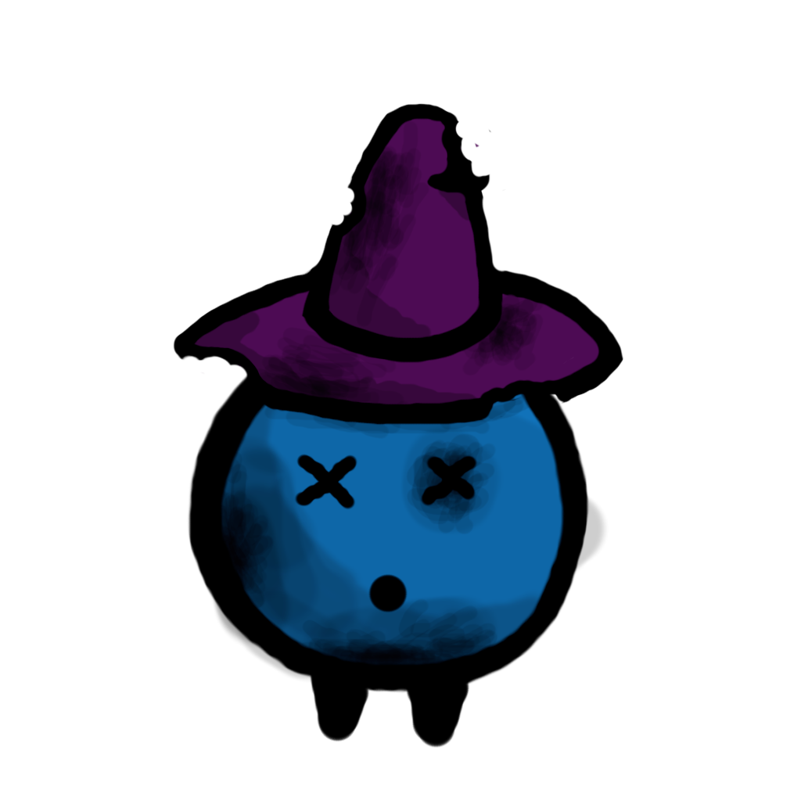

# Clash Of Issues - Client

Github analysis client

Authors : Adrien Allemand, Loyse Krug

## Clash of Issues

Clash of issues is an app that compare the number of resolved issues and commits of each member of your team. 

Once the client is running, you will have to connect to your github account.

After that, you'll be able to chose, among your owned repositories,  which one you want to analyse.

## Running the app

### 1. Clone this repo

```bash
$ git clone https://github.com/AdrienAllemand/TWEB-ClashOfCommit-Client.git
```

### 2. Install dependencies (optional)

```bash
$ npm install
```

### 3. Configure your server address and port

Simply set it up in the file [app.js](./js/app.js) 

```javascript
const serverUrl = window.location.hostname === 'localhost'
  ? 'http://localhost:3000'
  : 'https://afternoon-stream-70340.herokuapp.com';
```

You can replace `'http://localhost:3000'` with what ever the address of your server is.

### 4. Open index.html and enjoy

[Simply clic here !](./index.html)

## About the project

This project was intended to be much more than 2 graphs in a bootstrap template but we were caught up by the deadline. We did spent a lot of time struggling with the oAuth API and even if we used 4 days of our vacations on this project we weren't able to finish what we promised.

The pros are that we were able to extract the data we wanted (who solved how many issues) and finally managed to use the client's authentication token in time.

The cons is that we initially planed to make an XP system with a lot of stats such as lines added, numbers of commits or the usage of specific words in commits messages and much more, all to give each contributor a Level in sevral diciplines. 
Then we wanted a single graph displaying the contributors, sorted by level, with cutes images of the class that suited them best (commits are for wise magician, issues closed for shiny heroes in armor and total lines of code added were ment to represent barbarians). 

As often in the world of software developpement, our sad but hopefull users will never see the promissed features...

Despit all, we did manage to make a basic version of the Magician in his 3 states so enjoy it because there won't be any more :'(


This was meant to be the wizzard when he is leader of number of commits


This was meant to be the wizzard when he is average in the number of commits



This was meant to be the wizzard when he was a bad commiter...